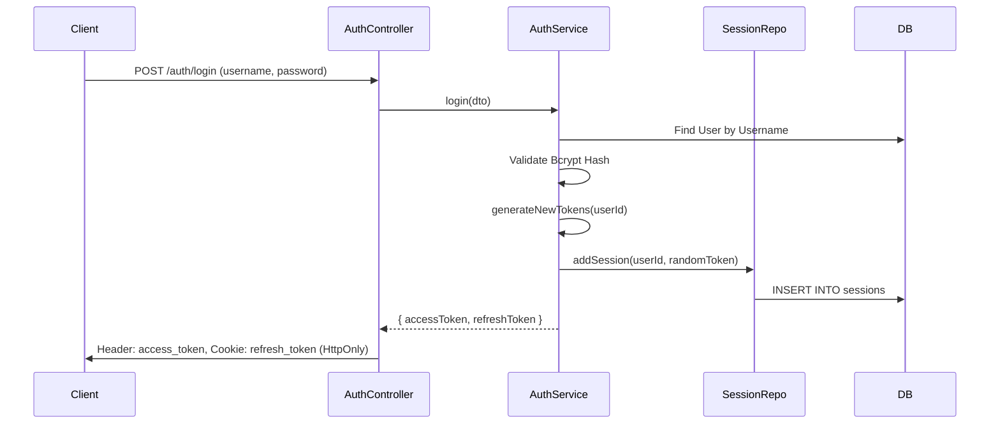
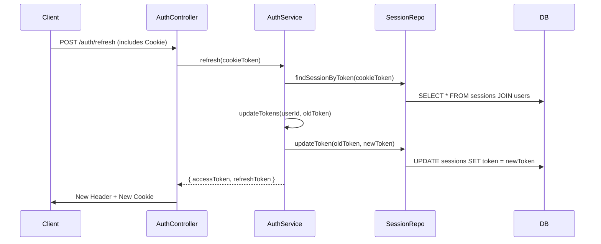

# MTS Spacehack Backend: Deep Dive Architecture

This document provides an exhaustive technical breakdown of the backend infrastructure, logic, and security patterns. It is designed to be a definitive reference for developers and auditors.

---

## 1. System Entry & Global Pipeline (`src/main.ts`)

The application entry point configures the global request-response pipeline.

### 1.1. Middleware & Configuration

- **Cookie Parser**: `app.use(cookieParser())` is registered to enable the server to parse the `Cookie` header into the `req.cookies` object. This is essential for the `HttpOnly` refresh token strategy.
- **Environment Context**: Loads `.env.dev` or `.env.prod`.
  - **Dev Note**: `DB_HOST` is set to `127.0.0.1` locally to bypass DNS/IPv6 resolution latencies common in development environments.
- **Global Prefix**: All routes are encapsulated under the `/api` namespace.

### 1.2. Global Validation Pipe

The system uses a highly restrictive `ValidationPipe`:

```typescript
new ValidationPipe({
  whitelist: true, // Strips properties not in the DTO
  forbidNonWhitelisted: true, // Throws error if unexpected properties exist
  transform: true, // Auto-transforms payloads to DTO instances
});
```

This configuration prevents **Mass Assignment** attacks and ensures that the API strictly adheres to its interface.

---

## 2. Modular Structure

- **`AppModule`**: The root module.
- **`AuthModule`**: The security pillar. It configures the `JwtModule` asynchronously using `ConfigService` to ensure `JWT_SECRET` is loaded before the module initializes.
- **`DatabaseModule`**: Manages the TypeORM lifecycle. In development, `synchronize: true` is enabled for schema agility.

---

## 3. The Logic Layers (Deep Dive)

### 3.1. Entity Layer (`src/models/`)

Entities represent the schema and include "Active Record" style hooks.

#### **User Entity & Hashing Lifecycle**

- **Before**: Blindly hashed `password` on every `BeforeUpdate`, leading to "Double Hashing" if the profile was updated without changing the password.
- **After (Security Fix)**:
  - `AfterLoad() @originalPassword = password`: Stores the hash when the entity is fetched.
  - `BeforeUpdate()`: Only hashes if `this.password !== this.originalPassword`.

### 3.2. Repository Layer (`src/repositories/`)

Repositories handle raw data access, abstracting TypeORM's complexity.

- **Refactoring (Composition over Inheritance)**:
  - **Before**: Custom classes extended `Repository<T>`. This often led to issues with NestJS's dependency injection and unit testing.
  - **After**: Repositories are standard `@Injectable()` classes. They inject the TypeORM `Repository` via `@InjectRepository(Entity)`. This follow's NestJS best practices for decoupling.

### 3.3. Service Layer (`src/auth/`, `src/services/`)

Business logic lives here. Services are the only place where cross-entity orchestration occurs.

#### **AuthService: Token Rotation Logic**

1. **Login**: Generates an **Access Token** (JWT, 15m) and a **Refresh Token** (64-byte random hex).
2. **Refresh (Rotation Pattern)**:
   - When a user refreshes, the server finds the session by the old token.
   - It generates a **brand new** refresh token.
   - It updates the database record: `oldToken` is replaced by `newToken`.
   - The old token is now invalid (Single-use tokens). This prevents replay attacks if a refresh token is stolen.

#### **AuthService: Transactional Safety**

```typescript
await this.dataSource.transaction(async (manager) => {
  await manager.save(User, user); // Update password
  await manager.delete('Session', { user_id: user.id }); // Clear ALL sessions
});
```

On password change, we use a **Database Transaction**. This ensures that if the password update succeeds, all existing sessions (logins on other devices) are nuked simultaneously. If one fails, neither happens.

### 3.4. Controller Layer

- **`AuthController`**:
  - **Cookie Transition**: Refresh tokens are now written to and read from `HttpOnly`, `Secure` cookies.
  - **Endpoints**: `/auth/register`, `/auth/login`, `/auth/refresh`, `/auth/logout`, `/auth/logout_all`, and `/auth/change_password`.
- **`Change Password Pattern`**:
  - **Route**: `POST /api/auth/change_password`.
  - **Logic**: Validates `oldPassword` first. Then checks if `newPassword` is identical to the current one (throws `PASSWORDS_IS_DUPLICATE`).
  - **Security**: Uses a database transaction. If the password update is successful, it **automatically deletes all active sessions** for that user. This ensures that any stolen refresh tokens on other devices become instantly invalid.
- **`UsersController`**:
  - **Identity Protection**: Exposes `/api/users`. Sensitive operations are protected by `RolesGuard`.
  - **Update Logic**: `PATCH /api/users/update_info` allows authenticated users to update their own profile data (email, phone, name). To prevent account takeovers, it requires the user's current password in the `UpdateUserDto`.

---

## 4. Security Flow Diagrams

### 4.1. Authentication Sequence (Login)



### 4.2. Token Refresh Sequence (Rotation)



---

## 5. Deployment & Runtime Infrastructure

### 5.1. Docker Strategy

- **Image**: `node:25-slim`. Standardized on a modern LTS version.
- **Multi-stage**: Builds the app in a `builder` stage, then copies only `dist` and `node_modules` to the production stage to keep image size minimal (~150MB).

### 5.2. Networking

- **Port 5050 (Dev)**: Mapped to avoid conflicts with other local services.
- **Database Access**: The production DB is bound to `127.0.0.1` inside the VPS. External access (e.g., via DBeaver) is done strictly through an **SSH Tunnel**.

---

## 6. Mobile Developer Guidance

1. **Host**: `http://localhost:5050/api` (Local) / `https://kurumi.software/api` (Prod).
2. **Credentials Storage**:
   - Access Token: Store in secure memory (not persistent).
   - Refresh Token: Handled by the browser/WebView cookie jar. Set `credentials: 'include'` in fetch calls.
3. **Response Statuses to Handle**:
   - `401 MISSING_REFRESH_TOKEN`: User must log in again.
   - `401 PASSWORD_IS_INCORRECT`: Used in password change if current password doesn't match.
   - `400 PASSWORDS_IS_DUPLICATE`: User tried to change password to the current one.
   - `403 FORBIDDEN`: Insufficient roles/permissions.
